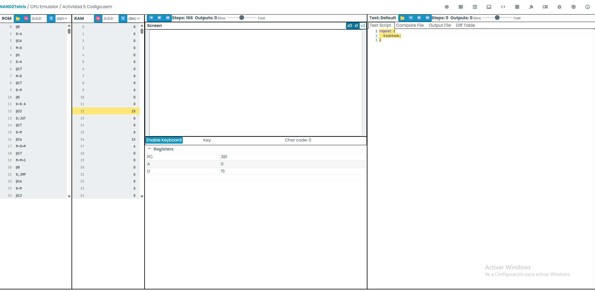

1. Identifica una instrucción que use la ALU y explica qué hace.

Una instrucción que utiliza la ALU es:

D=D-A

Explicación:

La ALU toma el valor almacenado en el registro D y le resta el valor del registro A.
El resultado se guarda nuevamente en D.

Otro ejemplo es:

M=M+1

Aquí la ALU suma 1 al contenido de la memoria (M) y guarda el resultado en la misma posición de memoria.

2. ¿Para qué sirve el registro PC?

El PC (Program Counter) o Contador de Programa almacena la dirección de la siguiente instrucción que debe ejecutar el procesador.

Normalmente aumenta automáticamente después de ejecutar una instrucción.
Si encuentra un salto como:
0;JMP

o

D;JNE

el PC cambia a la dirección indicada en el registro A, permitiendo ejecutar otra parte del programa.

3. ¿Cuál es la diferencia entre @i y @READKEYBOARD?
@i
Hace referencia a una variable llamada i.
Se utiliza para almacenar datos, por ejemplo un índice o contador.

Ejemplo:

@i
M=M+1

Incrementa el valor de la variable i.

@READKEYBOARD
Hace referencia a una etiqueta (label) del programa.
Se utiliza para realizar saltos.

Ejemplo:

@READKEYBOARD
0;JMP

Hace que el programa continúe ejecutándose desde la etiqueta (READKEYBOARD).

4. Describe qué se necesita para leer el teclado y mostrar información en la pantalla.

Para leer el teclado y escribir en la pantalla en la computadora Hack se necesita:

Acceder al registro del teclado:
@KBD
D=M
KBD contiene el código de la tecla presionada.
Si no hay tecla, su valor es 0.
Comprobar si existe una tecla presionada mediante instrucciones de salto:
D;JNE
Acceder a la memoria de la pantalla:
@SCREEN
Escribir un valor en la memoria de pantalla:
M=-1

o

M=0
M=-1 enciende todos los píxeles de esa palabra de pantalla.
M=0 los apaga.
5. Identifica un bucle en el programa y explica su funcionamiento.

Un bucle del programa es:

(READKEYBOARD)

...

@READKEYBOARD
0;JMP

Funcionamiento:

El programa entra en la etiqueta (READKEYBOARD).
Lee constantemente el estado del teclado.
Al llegar al final ejecuta:
@READKEYBOARD
0;JMP
Como 0;JMP siempre salta, vuelve al inicio y repite el proceso indefinidamente, revisando continuamente si se presiona una tecla.
6. Identifica una condición en el programa y explica su funcionamiento.

Una condición es:

@KEYPRESSED
D;JNE

Funcionamiento:

Antes de esta instrucción, D contiene el valor leído del teclado.
JNE significa Jump if Not Equal to zero (salta si D ≠ 0).
Si hay una tecla presionada (D es diferente de 0), el programa salta a la etiqueta (KEYPRESSED).
Si D vale 0, continúa ejecutando las instrucciones siguientes.

Otro ejemplo de condición es:

@READKEYBOARD
D;JLE

Esta instrucción salta a READKEYBOARD cuando el valor de D es menor o igual que cero (D ≤ 0).
